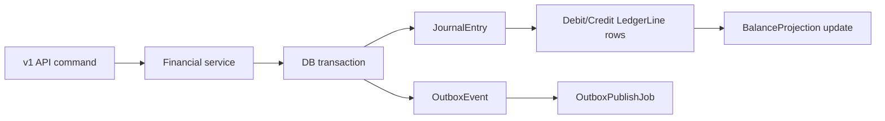

# Architecture Overview

## Request path

1. `Rack::Attack` applies IP and API-key throttles.
2. `RequestMetrics` records request metrics and structured JSON logs.
3. v1 controllers authenticate `X-Api-Key` and assign `Current.organization`.
4. Ops controllers authenticate Rails sessions and assign `Current.user` through `Current.session`.
5. Mutating API endpoints run through `Idempotency::Runner`; operator actions write explicit audit records.
6. Service objects open database transactions, validate state, post journal entries, update projections, and emit outbox events.
7. ActiveJob workers publish outbox events or settle approved Pix payments.

## Core boundaries

- Controllers: HTTP, authentication, serialization, idempotency wrapper.
- Ops controllers: human workflows, dense ERB screens, and controlled service calls.
- Services: business rules and transaction boundaries.
- Ledger: account lookup, balancing, projection updates.
- Jobs: asynchronous side effects.
- Models: associations, basic validations, enum state.

## Rails surfaces

- `/v1/*`: external JSON API, API-key authenticated, idempotent where commands mutate money.
- `/ops/*`: internal ERB/Hotwire backoffice, Rails-session authenticated, optimized for finance operations review.
- `/up`, `/ready`, `/metrics`: health, readiness, and Prometheus endpoints.

## Ledger flow

## Transaction boundaries

- Funding, transfer, Pix creation, Pix settlement, and reconciliation each run in a single database transaction.
- Wallet projections are locked before debits to prevent concurrent overdrafts.
- Journal entries are validated for balanced debit/credit totals before persistence.
- Outbox rows are created in the same transaction as ledger mutations.
