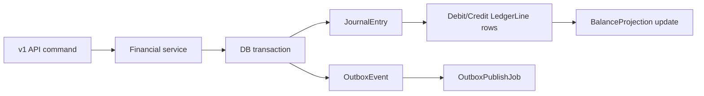

# Architecture Overview

## Request path

1. `Rack::Attack` applies IP and API-key throttles.
2. `RequestMetrics` records request metrics and structured JSON logs.
3. v1 controllers authenticate `X-Api-Key` and assign `Current.organization`.
4. Mutating endpoints run through `Idempotency::Runner`.
5. Service objects open database transactions, validate state, post journal entries, update projections, and emit outbox events.
6. ActiveJob workers publish outbox events or settle approved Pix payments.

## Core boundaries

- Controllers: HTTP, authentication, serialization, idempotency wrapper.
- Services: business rules and transaction boundaries.
- Ledger: account lookup, balancing, projection updates.
- Jobs: asynchronous side effects.
- Models: associations, basic validations, enum state.

## Ledger flow

## Transaction boundaries

- Funding, transfer, Pix creation, Pix settlement, and reconciliation each run in a single database transaction.
- Wallet projections are locked before debits to prevent concurrent overdrafts.
- Journal entries are validated for balanced debit/credit totals before persistence.
- Outbox rows are created in the same transaction as ledger mutations.
